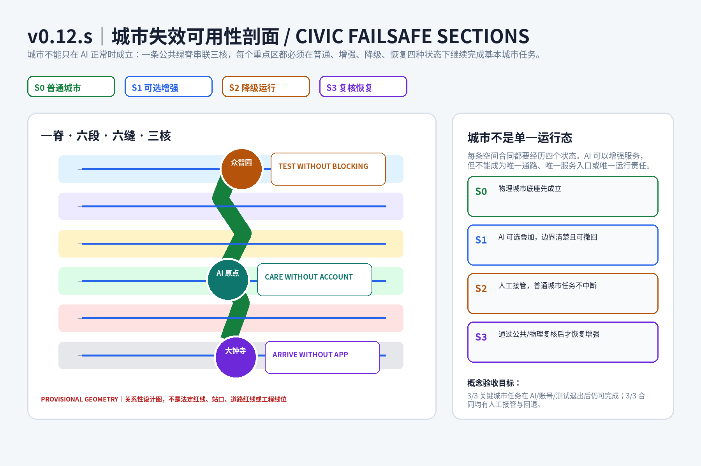
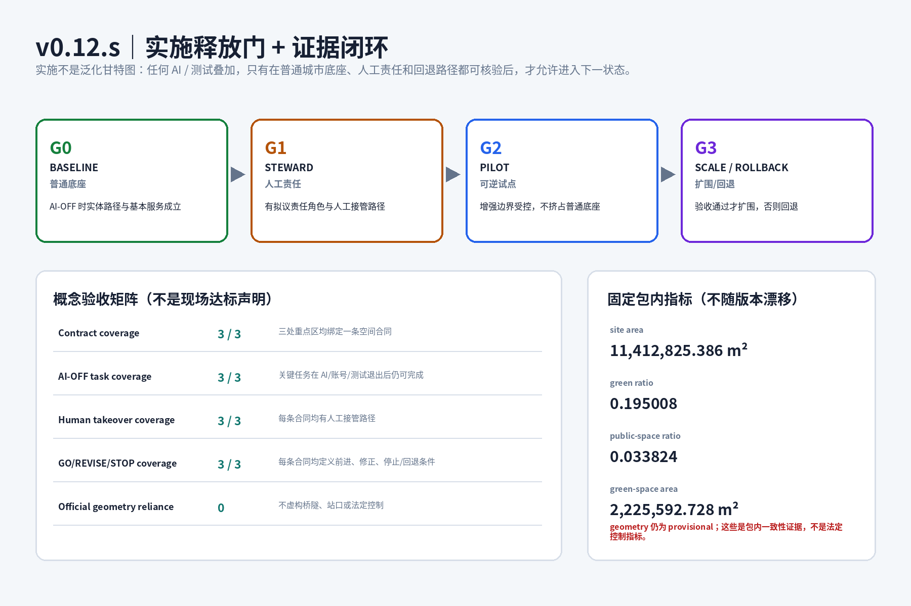

# 京张城市完整度 v0.12.s / CIVIC FAILSAFE SECTIONS

> **先把城市做完整，再让 AI 进入日常；城市也必须在 AI 失效时仍然成立。**
>
> v0.12.s 不把“空间合同”理解成新的法规，也不把 AI-OFF 做成一句伦理口号，而是把三处重点区分别设计成可经历 **S0 普通城市、S1 可选增强、S2 降级运行、S3 复核恢复** 四种状态的城市剖面。基本通行、照护、工作、等候、休息和公共生活属于普通城市；AI、机器人、动态信息和测试只能在不挤占这些能力的前提下叠加。

## 设计依据与资料清单

本方案继续依据资格预审公告、`brief/site-package/`、面向智能体任务书、仓库 source registry 与既有公开规划资料工作。公告约 43.6 km² 统筹研究范围、约 11.4 km² 总体设计范围和三处重点区域合计约 368.4 ha用于任务尺度判断；当前 `SITE_BOUNDARY` 与三处 `KEY_AREA` 仍是仓库维护的 provisional rough geometry，只用于相对关系、拓扑、概念面积和设计表达，不构成法定红线、权属、道路红线、站口、控规或工程实施结论。[source:OFFICIAL-ANNOUNCEMENT] [source:BOUNDARY-SOURCE]

设计只采用仓库登记的用地、建筑和来源枚举；正式 FAR、高度、密度、退界、道路红线、逐栋现状、权属、市政、消防和文保控制未完整公开，因此本案不以假精度换取“实施感”。公开规划原件只在它真正改变空间判断的位置进入设计，例如知春路及铁路/道路节点的竖向连续性、京张绿廊公共界面和公开地块强度参照；所有这些信息都保持证据等级，不升级为本方案的审批控制。[source:PLANNING-LIMITS] [standard:MOHURD-URBAN-DESIGN-MEASURES]

v0.12.s 的新增证据不是另一个孤立 JSON，而是同时进入 `proposal.md`、双语 report、canonical 图、A3/A0 首屏、`compliance_matrix.json` 和 `design_depth_matrix.json`。这样人类评委和 Review Agent 在不同入口看到的是同一套“普通任务—空间合同—状态转换—人工接管—回退验收”逻辑。[source:FORMAL-GUIDE]

## 三层范围工作框架

统筹研究范围回答“AI 创新生态如何与长期城市生活形成互相依赖的机制”；总体设计范围回答“一脊、六段、六缝、三核怎样承载 C7 七项普通城市能力”；三处重点区则回答“当 AI、账号或测试不可用时，具体空间是否仍然可用”。三层并不机械放大同一张图，而是从机制、连续空间到可验收剖面逐级收敛。[source:DESIGN-BRIEF] [depth:three_level_scope_framework]

约 11.4 km² 的总体设计范围继续以京张公共绿脊作为共同骨架，六段工作片区和六条东西缝合联系承担城市能力补缺；三核不被理解成三个“AI 展厅”，而是三种不同的城市类型。provisional boundary 的包内复算面积仍用于一致性检查，official polygon 到位后才重算绝对面积、重点区边界关系和需要受正式控制影响的指标。[metric:site_area_sqm] [data:geometry/site_boundary.geojson#SITE-001]

三处重点区的状态设计不依赖虚构工程条件：众智园讨论测试与普通公共通行的关系；AI 原点讨论照护、公共首层和账号门槛；大钟寺讨论到达、固定导视、人工求助和真实竖向连续性。只有正式站口、道路、铁路和桥隧资料到位后，才把关系性剖面推进为工程位置。[source:KEY-AREA-SOURCE]

## 统筹研究范围产业与未来城市研究

本案延续“研究—转译—测试—采用—长期生活”的 AI 创新生态链：高校与研究机构提供知识与人才，众智园承担研发和受控测试，AI 原点检验技术能否进入正常社区生活，大钟寺承担城市采用与到达界面，京张遗址公园提供贯穿全带的公共反馈场。产业与人才目标必须回到 C7：住房、学习、照护、移动、绿色、工作和公共生活任何一项被技术试验挤压，都不算“适配 AI 的未来城市”。[source:AGENT-TASKBOOK] [standard:PROJECT-AGENT-OPEN-CALL-TASKBOOK]

全球案例仍只转译机制：Vector Institute 的研究—产业连接、Mila 的开放科学与责任 AI、Alan Turing Institute 的跨学科和公众参与、AI Singapore 100 Experiments 的问题—PoC—扩围流程、Seoul AI Hub 的人才/创业/共享空间并置、Punggol Digital District 的产业—大学—社区相邻关系，均不被用来证明北京的法定强度或行政合作已经成立。[source:CASE-VECTOR] [source:CASE-AISG-100E]

品牌继续采用投稿方案自身的 **C7 COMPLETE LOOP**：开放环代表城市能力持续补齐，两条轨线回应京张线性记忆，七节点对应 HOME / LEARN / CARE / MOVE / GREEN / WORK / COMMON LIFE。v0.12.s 给它增加“STATE NOT DEVICE”的传播语义：国际传播首先解释城市在普通、增强、降级、恢复四态下如何保持市民能力，而不是展示某一代设备。[source:AGENT-TASKBOOK]

## 总体设计范围城市更新与控规深度城市设计

总体空间结构仍是一脊、六段、六缝、三核。公共绿脊先承担步行、骑行、无障碍、遮阴、雨洪、文化记忆与免费停留，再叠加环境感知和数字导览；六条东西向缝合关系优先连接社区—公园—高校/园区—轨道/街区，但不冒充确定的新路、桥隧或站口。[depth:overall_spatial_structure] [data:geometry/roads.geojson#ROAD-001]

v0.12.s 的规划创新是把空间从“一个正常运行的静态方案”改写为“有状态转换的公共基础设施”。**S0 ORDINARY** 要求物理城市底座先可用；**S1 ENHANCED** 允许 AI、动态导视、机器人或测试作为可选层；**S2 DEGRADED** 在设备、模型、账号、网络或测试退出时由固定设施和人工角色接管；**S3 RECOVERY** 不自动恢复增强，而要在普通路径、人工接管和退出状态再次通过复核后才允许重启。状态转换本身成为城市设计对象，而不是系统后台逻辑。[source:AGENT-TASKBOOK] [depth:overall_spatial_structure]

该方法不要求新增一种“AI 用地”，而是在既有住宅、社区服务、科研、教育、文化、商业和公园绿地之间明确哪些空间属于不可被算法挤占的城市底座，哪些空间可以承担可逆试点。正式 FAR、高度和逐栋拆改留继续保持待确认；概念建筑只承担容量与邻接研究。[source:LAND-USE-CODES] [metric:land_use_feature_count]

## 重点区域详细设计

### 众智园：完整创新校园 / TEST WITHOUT BLOCKING

普通城市任务是“到达—研发/服务劳动—吃饭休息—共享空间—离开”，这条链先于机器人或算法测试成立。空间合同要求测试进入与普通通行可区分、可关闭、可撤除的受控口袋或支路，公众主路径和公共绿脊不因试验开闭而迁移；现场必须存在能够停止试验并恢复普通状态的人工责任角色。这里不规定未经来源支持的测试道宽度、路桩规格或设备间距，而把“普通路径是否连续”作为概念阶段的第一验收问题。[data:geometry/key_areas.geojson#PROV-KEY-001] [depth:three_key_area_detailed_design]

实施采用 G0—G3 释放门：G0 先走查普通工作、休息与公共通行；G1 确认拟议的公共空间管理角色和测试运营角色、人工停止路径与维护边界；G2 才允许可逆试点；G3 只有在测试关闭后普通任务仍不改变时才允许扩围，否则回退。责任以“角色”提出，具体法律主体和许可关系待正式运营主体确认，避免把尚未授权的机构写成既成承诺。[source:AGENT-TASKBOOK]

### AI 原点：完整长期社区 / CARE WITHOUT ACCOUNT

普通城市任务是“家门—遮阴/休息—照护/求助—公共客厅—绿廊”。空间合同要求基本服务入口不以注册、登录、授权个人数据或拥有智能手机为前提；实体路径、固定信息、人工窗口/电话/纸质流程构成 S0 和 S2 的共同底座。AI 可以做导航、多语辅助、服务匹配和照护提示，但不得成为唯一入口。[data:geometry/key_areas.geojson#PROV-KEY-002] [depth:three_key_area_detailed_design]

G0 验收“无账号的人能否完成基本照护和求助”；G1 明确拟议的社区公共服务角色、人工接管和维护责任；G2 才测试可选 AI；G3 的扩围条件是拒绝数据、账号失效或模型退出均不改变基本服务路径。该设计把数字包容直接转化为公共首层与服务门槛，而不是只写隐私声明。[source:AGENT-TASKBOOK]

### 大钟寺：完整站城生活区 / ARRIVE WITHOUT APP

普通城市任务是“到达—识别方向—换乘/求助—普通等候与商业—京张遗产公共界面”。空间合同把固定双语导视、可理解的实体入口、人工求助和无障碍连续意图作为底座，动态多语信息、拥挤提示和个性化路线只能增强。当前不依据 provisional polygon 推导真实站口、桥、隧道或道路工程；知春路及铁路/道路节点只被标记为必须由真实竖向条件解决的设计问题。[data:geometry/key_areas.geojson#PROV-KEY-003] [source:KEY-AREA-SOURCE]

G0 先验证“不用手机是否仍能完成到达和求助”；G1 明确拟议的站城公共界面/人工服务角色；G2 才允许动态信息增强；G3 只有在动态系统关闭后普通到达链仍清楚时才扩围。这个原型的重点不是科技展示，而是把“可读性”作为站城公共空间的基础设施。[depth:traffic_rail_slow_parking]

## AI 创新生态、人才画像与 AI+ 场景

用户画像继续覆盖研究者、服务劳动者、长期居民、老人、儿童/照护者、无智能手机者、通勤者、国际访客和小微商户。v0.12.s 不为他们分别做九套 App，而用同一个问题测试所有场景：**当数据、账号、模型或设备不可用时，此人是否仍然能完成原本的城市任务？** [metric:persona_count] [source:AGENT-TASKBOOK]

十类场景继续覆盖产业测试、企业服务、健康服务导航、教育/文化、多语到达、低速配送、公共空间环境感知、开发者活动、社区服务匹配和城市运营辅助。每个场景必须声明空间位置、服务对象、非 AI 基线、人工接管、退出规则和风险。产业测试中的 SCN-01 / SCN-05 / SCN-09 只在受控、可退出的范围内工作，不能以测试需求覆盖公共通行或基本服务。[metric:ai_scenario_count] [metric:industry_test_scenario_count]

三个旗舰试点仍采用“前置条件—小范围测试—可读收据—GO / REVISE / STOP”协议；v0.12.s 把 STOP 从运营表格推进为空间状态：STOP 后必须回到 S0/S2 的普通物理路径和人工服务，设备退出不能留下新的城市门槛。[source:AGENT-TASKBOOK]

## 用地、建筑规模与拆改留方案

用地继续使用住宅、社区服务、科研、文化、教育、商业服务和公园绿地等允许分类，不创造“AI 用地”。13 个概念用地 feature 和 13 个概念建筑原型用于检查居住、公共服务、研发、商业、绿地和公共首层的邻接关系；建筑基底、层数和容量属于设计模型，不是现状测绘或获批开发规模。[data:geometry/land_use.geojson#LU-001] [data:geometry/buildings.geojson#BLDG-001]

正式容积率、建筑高度、密度、退界、道路红线、逐栋保留/改造/拆除判定仍需官方控规、权属、结构、消防和文保资料。v0.12.s 不用未经核验的米数或设备规格制造“工程完成度”，而通过状态合同确定未来深化时必须保留的公共性能：普通路径不能被试点永久占用、基本服务不能被账号取代、站城到达不能依赖个人终端。[source:PLANNING-LIMITS] [depth:development_intensity_controls]

这也定义了拆改留的先后顺序：先调查并确认真实建筑与控制，再决定保留、改造、拆除或新建；在数据不足阶段只提出可逆的 infill / reuse 研究动作，不把概念建筑编号当成真实拆迁对象。[depth:retain_renovate_demolish]

## 交通、轨道、市政与公共服务设施

一条南北公共绿脊和六条东西缝合联系继续构成优先步行、骑行和无障碍的概念网络。道路中心线表达连接意图，不是道路红线；轨道接驳表达“需要解决的到达关系”，不推断真实站口。大钟寺的 ARRIVE WITHOUT APP 由固定导视、人工求助和普通等候/商业支撑；正式竖向工程关系待真实道路、铁路和站点资料核验。[depth:traffic_rail_slow_parking] [source:ALLOWED-DESIGN-SPACE]

市政与新型基础设施采用同样的失效可用原则：公共照明、基本通信求助、无障碍设施、排水和普通公共服务不应以某个 AI 平台持续在线为前提；端侧算力、环境感知和数字服务属于可替换增强。具体电力容量、管线、通信 SLA 和设备选型仍需实施阶段调查，不在概念方案中虚构。[depth:municipal_new_infrastructure]

## 蓝绿空间、公共空间与城市风貌

京张遗址公园和公共绿脊是最重要的“非数字公共基础设施”：连续步行、遮阴、停留、雨洪、文化记忆与免费使用先成立，环境感知、数字导览和活动信息后叠加。AI 原点的 CARE WITHOUT ACCOUNT 把绿廊侧公共首层和休息/照护链连在一起；众智园的测试不得切断绿脊；大钟寺的到达界面最终回到可读的遗产公共空间。[depth:blue_green_public_space] [metric:green_ratio]

三个 AI 朝圣地标继续采用功能性而非娱乐化路径：Open Test Yard 展示“测试可以停止”；City Commons Hall 展示“公共服务不需要账号”；Jing-Zhang Civic Station 展示“到达不需要 App”。它们首先是公共空间和荣誉/知识展示节点，其次才是技术体验，不使用未经授权的官方 Logo、企业标识或“已批准建设”的视觉语言。[source:AGENT-TASKBOOK]

城市风貌不追求统一的“科技蓝”：众智园强调开放研发与可见边界，AI 原点强调日常街道、遮阴与公共首层，大钟寺强调站城可读性和京张遗产连续性。状态标识使用一致的信息层级，但不伪装成政府标准系统。[source:AGENT-TASKBOOK]

## 更新项目清单、实施政策与分期计划

v0.12.s 把实施分期改写为四个释放门，而不是给未知主体编造建设日期。**G0 BASELINE**：先完成普通城市任务走查和缺口登记；**G1 STEWARDSHIP**：为每条合同确认拟议责任角色、人工接管、维护边界和退出方法；**G2 REVERSIBLE PILOT**：只允许不挤占 S0 底座的小范围试点；**G3 SCALE / ROLLBACK**：通过概念验收才扩围，任一普通路径或基本服务被阻断则回退。[data:geometry/phasing.geojson#PHASE-001] [depth:phasing_implementation]

拟议责任不是虚构行政授权，而是五类必须被真实主体承接的角色：公共空间管理、基本公共服务/人工接管、测试运营、站城公共界面、跨项目复核。正式实施时可由真实街道、园区、运营单位或其他依法确定主体承接；概念阶段只要求“责任不能消失在算法供应商与公共部门之间”。[source:AGENT-TASKBOOK]

长期运营继续包括年度开发者/公众活动、场景开放、国际传播、公共体验路线和有效试点转化，但任何活动、招商、资金或政策安排均是概念建议。所有增强项目都需要退出设计：运营商更换、模型停用或设备撤场后，普通公共空间不留下无法维护的专用障碍。[source:AGENT-TASKBOOK]

## 指标体系、面积复算与合规矩阵

固定包内指标继续作为几何一致性证据：`site_area_sqm=11412825.386`、`green_ratio=0.195008`、`public_space_ratio=0.033824`、`green_space_area_sqm=2225592.728`。它们是基于 provisional geometry 的提交包设计量，不是法定审批指标；official geometry 到位后需要重算。[metric:site_area_sqm] [metric:green_ratio]

v0.12.s 的实施验收不用伪造现场绩效，而采用“概念合同覆盖率”：3/3 重点区绑定明确空间合同；3/3 关键任务声明 AI/账号/测试退出后的普通完成路径；3/3 具有人工接管；3/3 具有 GO / REVISE / STOP 与回退条件。这些是方案完整性目标，不声称现场已经测试达标。具体指标由 `metrics.json` 承担机器复核，并显式记录空间合同数、AI-OFF 关键任务覆盖率和 G0–G3 释放门数量。[metric:spatial_contract_count] [metric:ai_off_critical_task_coverage_ratio] [metric:civic_release_gate_count]

`compliance_matrix.json` 把空间合同映射到公告 1.3/1.4/1.5 与 agent.1-agent.6；`design_depth_matrix.json` 则把三合同映射到总体结构、重点区详细设计、交通、市政、公共空间、分期和风险。v0.12.s 的目的不是增加更多清单，而是让正文、矩阵、五张 canonical 图、report 和 PDF 对同一设计事实说同一种话。[source:FORMAL-GUIDE]

## 风险、版权与合规说明

最大空间风险仍是 provisional `SITE_BOUNDARY` 与 `KEY_AREA`，尤其大钟寺临时 polygon 的绝对位置风险。因此本方案只表达任务角色和关系性空间判断，不输出真实站口、产权、道路红线、桥隧工程、正式 FAR/高度或已批拆改留。[source:KEY-AREA-SOURCE] [depth:risk_missing_data]

数据与算法风险采用最低必要原则：基本通行、照护、公共空间和人工服务不因拒绝个人数据而消失；高风险判断转人工；公众不因拒绝参与试验失去城市权益。运营风险则通过 G0-G3 和 S0-S3 状态转换处理：增强可以停，城市不能跟着停。[source:AGENT-TASKBOOK]

所有图件由本方案基于包内几何、指标和自绘图形生成，不使用远程地图截图、未经许可人物、政府徽记或第三方企业 Logo。C7 COMPLETE LOOP 与三个空间合同是投稿方案自身识别和概念设计语言，不构成官方赛事 Logo、政府政策、实施承诺或已经完成的现场验证。[source:SOURCE-REGISTRY]

## 参考资料

1. 百年京张 AI 创新带资格预审公告与任务要求，用于范围、重点区与任务尺度。[source:OFFICIAL-ANNOUNCEMENT]
2. `brief/site-package/` 与 source registry，用于 formal / background / provisional 资料分级。[source:SITE-PACKAGE]
3. 面向智能体任务书，用于三大定位、五大功能、六项 agent 任务和 Review Agent 证据结构。[source:AGENT-TASKBOOK]
4. 住建部城市设计与控规相关公开标准，用于概念城市设计的专业深度边界。[standard:MOHURD-CONTROL-DETAILED-PLANNING]
5. 仓库登记的海淀城市更新、AI 产业与公开地块/绿廊现实资料，只在其证据许可范围内改变空间判断，不作为本方案法定控制。[source:HD-URBAN-RENEWAL-GUIDE-2025]
